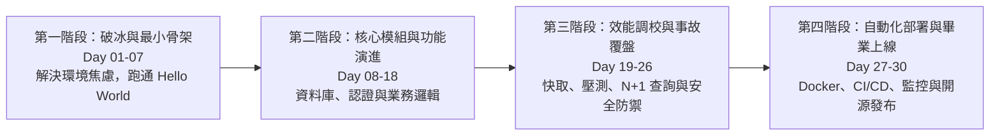

# 長篇系列專欄閱讀節奏與敘事弧線指南

本指南專門解析 30 至 50 篇長篇系列教學文（如 iThome 鐵人賽、Medium 系列專欄、電子書連載）如何設計宏觀學習弧線、跨篇章懸念銜接，以及如何跨越讀者容易放棄的「第七天斷崖」與「第二十天低谷」。

---

## 讀者流失節點分析與防棄坑對策

在長達 30~50 天的連載過程中，讀者通常會在特定的心理疲勞節點流失：

| 讀者危險流失節點 | 心理疲勞主因 | 專欄架構防禦對策 |
| :--- | :--- | :--- |
| **第 07 ~ 09 天（環境建置與新手牆）** | 讀者剛裝好環境，開始接觸大量陌生語法，感到挫折與焦慮。 | 安排一個「5 分鐘見效的小里程碑」，讓學員在第 7 天看見可以點擊或回應的具體成果。 |
| **第 18 ~ 22 天（枯燥期與疲勞低谷）** | 連續多天進行 CRUD 或細節配置，缺乏新鮮感與成就感刺激。 | 插入一場「真實生產事故覆盤（War Story）」或「壓測打爆伺服器挑戰」，打破沉悶氣氛。 |
| **第 26 ~ 28 天（終點前力竭）** | 內容進入複雜的分散式或 Docker/CI 部署，難度陡升。 | 提供開箱即用的 Boilerplate 與完整 Dockerfile 範本，降低最後一哩路的實作門檻。 |

---

## 四階段宏觀學習弧線心智模型

一門優秀的 30~50 篇專欄不該是平鋪直敘的語法清單，而是一部具備「起承轉合」的工程冒險故事：

---

## 跨篇章敘事連續性三元素 (Yesterday / Today / Tomorrow)

為了讓讀者像追劇一樣每天主動開啟下一篇，每篇文章的開頭與結尾必須配置「前呼後應」的思維橋樑：

### 1. 開篇前置導讀與昨日回顧 (Yesterday Callback, 1~2 句)
* **範例**：*「在昨天的第 15 天中，我們為 API 加上了 JWT 認證，成功將訪客與會員隔離；但如果你仔細觀察資料庫查詢，會發現每次驗證 Token 時，系統都在重複查詢同一張使用者表...」*
* **作用**：喚醒讀者前一天的記憶，並為今天的改動建立自然的需求動機。

### 2. 本文核心交付物 (Today Mission, 唯一主旨)
* **原則**：一篇只做一件事。不要在同一天同時教「資料庫 Migration」、「JWT 認證」和「Redis 快取」。
* **篇幅控制**：字數控制在 1,500 ~ 3,000 字，程式碼改動量 150 行以內，確保讀者能在 15~20 分鐘內讀完並寫完程式碼。

### 3. 文末懸念預告與明日鉤子 (Tomorrow Teaser, 1~2 句)
* **範例**：*「今天我們把 Redis 快取加上去了，查詢延遲直接從 80ms 壓到了 2ms。但是，如果明天是雙十一大促，10 萬名使用者在同一秒存取一個剛好過期的熱門商品，資料庫會發生什麼事？明天第 21 天，我們將直面快取擊穿的慘烈現場！」*
* **作用**：製造懸念，打破讀者的心理句點，激發對下一篇的期待。

---

## 系列文章節奏配比矩陣 (Rhythm Balancing)

全系列 30~50 篇應當維持合理的體裁比例，避免單一形式造成的閱讀疲乏：

| 文章體裁類型 | 全系列推薦佔比 | 核心功能與呈現形式 |
| :--- | :--- | :--- |
| **功能開發實戰篇 (Hands-On Feature)** | **50% ~ 60%** | 一步一腳印寫出真實程式碼，搭配測試案例與終端機輸出。 |
| **架構原理深度解構 (Deep Dive)** | **15% ~ 20%** | 使用 Mermaid 圖解底層機制、記憶體佈局或網路協定流向。 |
| **真實踩坑事故覆盤 (War Story)** | **10% ~ 15%** | 重現錯誤日誌、排查過程、Before/After 壓測對照與避坑心法。 |
| **中場檢核與里程碑總結 (Checkpoint Lab)** | **10%** | 提供自測練習題、架構回顧腦圖與 Git Tag 階段性驗收。 |
